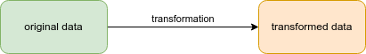
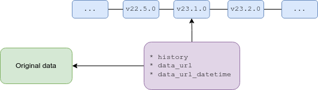

# Tengen


[](https://pdm.fming.dev)

Collection of notebooks to manage reference solar irradiance spectrum datasets.

## Aim

A number of reference solar irradiance spectra has been made available.
However, their original format are various and often non-standard.
The aim of this repository is to gather all of these reference solar irradiance 
spectra at the same place and under a 
[unique well-defined standard format](#dataset-format-and-schema).

## Motivation

The need to organise and manage reference solar irradiance spectrum datasets
originated in the development of the
[Eradiate](https://github.com/eradiate/eradiate) radiative transfer model.
Such a radiative transfer model takes a solar irradiance spectrum as input to
a radiative transfer simulation.
The radiative transfer model usually does not work directly with the original 
data but instead stores the corresponding data under a specific format.
To convert the data to the specific format, the original data is transformed.
This comes with two challenges:

* the transformation algorithm must not introduce any error
* the data traceability must be preserved

which *Tengen* aims to address.

## Notebooks

The work of downloading and converting raw data for each solar irradiance
spectrum to a unique format is stored in [Jupyter](https://jupyter.org/) 
notebooks, under `notebooks/`.
The idea is to have one notebook per solar irradiance spectrum, or per group
of spectra if the latter somehow come together, e.g. different observation 
time periods or different spectral resolutions associated to the same 
observation data.

For example, the `thuillier_2003.ipynb` notebook downloads the raw data for 
the well-known *Thuillier (2003)* reference solar irradiance spectrum and
converts it to the unique format.


### Run a notebook

To generate the dataset(s), run the corresponding notebook(s).

#### Run from the command line

You can run a notebook from the command line, [using the `nbconvert` library](https://nbconvert.readthedocs.io/en/latest/execute_api.html#executing-notebooks-from-the-command-line).
For example, the `whi_2008.ipynb` notebook is executed with:

```shell
jupyter nbconvert --to notebook --execute notebooks/whi_2008.ipynb
```

Run all notebooks with:

```shell
jupyter nbconvert --to notebook --execute notebooks/*.ipynb
```


### Write a notebook

Each notebook follows a template defined by `notebooks/tempplate.ipynb`. A notebook is divided into four sections:
* a *Setup* section: this is where imports are made and global information about the dataset is set
* a *Download* section: this is where the function to download the raw data is implemented
* a *Format* section: this is where the function to format the raw data to the *Tengen* format is implemented
* a *Run* section: identical to all notebooks, executing the cells in this section will download and format the dataset(s) and save them in temporary files or in the cache depending on the value of `UPDATE_CACHE`.

To write a new notebook, begin by copying the template and modify it to 
provide the required information and methods implementation.
In case of doubt, take example on existing notebooks.

Before pushing your notebook to the repository, make sure to run `nbstripout`
on it to remove cells outputs:

```shell
nbstripout notebooks/your_notebook.ipynb
```


## Dataset format and schema

Every notebook produces solar irradiance spectrum datasets with the same unique format and schema, which are described here.

### Format

Datasets comply with the [netCDF](https://www.unidata.ucar.edu/software/netcdf/) format.

### Schema

#### Variables

The dataset contains one data variable:
* the **s**olar **s**pectral **i**rradiance, denoted `ssi`.

The solar spectral irradiance has two dimensions:
* a **t**ime dimension, denoted `t`,
* a **w**avelength dimension, denoted `w`.

The time dimension refers to the time at which the solar spectral irradiance was observed.
Associated to these two dimensions are two coordinate variables, denoted `t` and `w`, respectively.

| Symbol |          Long name          |             Standard name              |      Units      |
| :----: | :-------------------------: | :------------------------------------: | :-------------: |
| `ssi`  | `solar spectral irradiance` | `solar_irradiance_per_unit_wavelength` | `W / m **2/ nm` |
|  `w`   |        `wavelength`         |         `radiation_wavelength`         |      `nm`       |
|  `t`   |           `time`            |                 `time`                 |     `days`      |


#### Metadata

Dataset metadata comply with the [NetCDF Climate and Forecast (CF) Metadata Conventions](https://cfconventions.org/Data/cf-conventions/cf-conventions-1.10/cf-conventions.html).

The following dataset metadata are set:

* `title`: the title of the dataset
* `institution`: the institution where the original data was produced
* `source`: the method of production of the original data
* `history`: the history of transformations that the original data has undergone
* `references`: the publications of web-based references that describe the 
  original data and/or the methods used to produce it
* `data_url`: the URL where the original data has been downloaded from
* `data_url_datetime`: the date and time at which the original data has been 
  downloaded

## Traceability

[Data traceability](https://codata.org/rdm-terminology/data-traceability/)
means that one is able to track all the transformations that a dataset has
undergone from its original form to its current form.
*Tengen* cannot guarantee data traceability but it strives to provide the
means to do so.
When a notebook is run, the original data is downloaded and converted, i.e.,
transformed, to the *Tengen* format.



To preserve the traceability of the data, the following information is stored
in the dataset metadata:

* that date and time at which the dataset was created, including the
  corresponding *Tengen* version (`history`)
* the original data URL (`data_url`)
* the date and time at which the original data was downloaded (`data_url_datetime`)

The attribute `history` create a link between the transformed data and the 
transformation algorithms (this repository) whereas the attributes `data_url` 
and `data_url_datetime` create a link between the original data and the 
transformed data.



If any one of these two links is broken, the traceability of the data is lost.

Since the existence and accessibility of the original data cannot be guaranteed,
data that was downloaded from a URL may not be available anymore at a later
date.


This is the reason why Tengen cannot guarantee data traceability.
This is also the reason why a [cache system](#cache) is provided.

## Cache

A cache is managed that stores the original (raw) and formatted data.
By default, running a notebook does not populate the cache.
To make it so, modify the following line in the *Setup* section of a notebbok:

```python
UPDATE_CACHE = False  # change to True to update the cache when running this notebook
```

and change the value to `True` as indicated in the comment.

